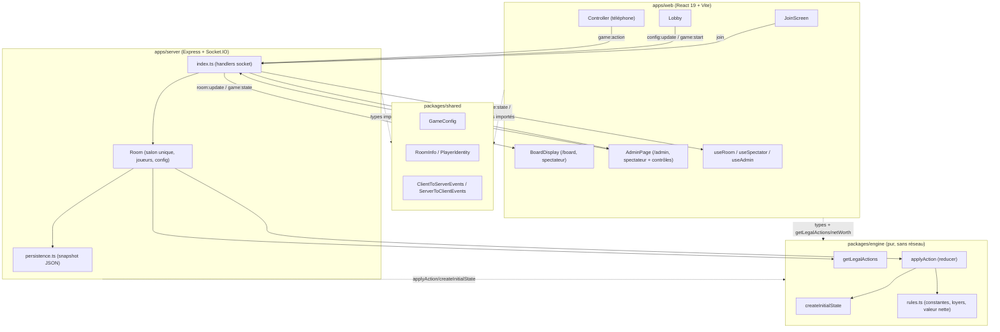
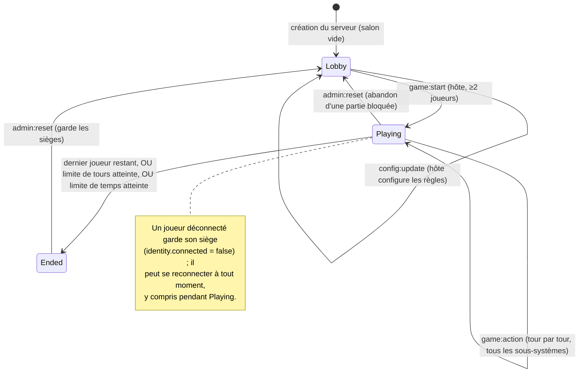

# PolyPoly — Documentation technique complète

> Documentation générée à partir d'une lecture exhaustive du code source (branche `main`). Toute affirmation ci-dessous est vérifiable dans les fichiers référencés (`chemin/fichier.ts:ligne`). Là où le comportement exact n'est pas évident depuis le code, c'est signalé explicitement plutôt que deviné.

## Sommaire

1. [Vue d'ensemble](#1-vue-densemble)
2. [Architecture générale](#2-architecture-générale)
3. [Les apps et packages](#3-les-apps-et-packages)
4. [Modèle de données / état de jeu](#4-modèle-de-données--état-de-jeu)
5. [Protocole de communication](#5-protocole-de-communication)
6. [Règles du jeu telles qu'implémentées](#6-règles-du-jeu-telles-quimplémentées)
7. [Mécaniques originales](#7-mécaniques-originales)
8. [Cycle de vie d'une partie](#8-cycle-de-vie-dune-partie)
9. [Frontend](#9-frontend)
10. [Persistance et reconnexion](#10-persistance-et-reconnexion)
11. [Build, configuration, variables d'environnement](#11-build-configuration-variables-denvironnement)
12. [Déploiement](#12-déploiement)
13. [Pistes d'amélioration et limitations connues](#13-pistes-damélioration-et-limitations-connues)

---

## 1. Vue d'ensemble

PolyPoly est un Monopoly multijoueur en ligne à thème voyage (plateau "tour d'Europe"), conçu pour être joué en soirée sur un réseau local : chaque joueur rejoint depuis son téléphone en scannant un QR code, un PC ou une TV peut afficher le plateau en lecture seule pour tout le monde, et un panneau admin permet à l'hôte de gérer la partie.

Le projet ajoute, au-dessus des règles classiques, un ensemble de mécaniques originales activables indépendamment via un écran de configuration (`packages/shared/src/config.ts`) : alliances temporaires, prise d'otage de propriété depuis la prison, météo (jours de pluie/soleil), cartes "squat" (nuit gratuite chez un adversaire), et un mode santé complet (jauge de vie, cases à effet, hôpitaux, maladie).

Le dépôt est un monorepo npm workspaces avec une séparation stricte entre le moteur de jeu (pur, sans état réseau, testé) et sa mise en réseau (serveur Socket.IO + client React).

## 2. Architecture générale



Points clés :

- Le **moteur** (`packages/engine`) est un reducer pur : `applyAction(state, action, rng) -> { state, events }` (`packages/engine/src/applyAction.ts:35`). Il ne connaît ni Socket.IO, ni React, ni la persistance.
- Le **serveur** (`apps/server`) est la seule autorité : il applique les actions reçues du réseau au moteur, diffuse le nouvel état et les événements à tous les clients connectés, et persiste un snapshot après chaque changement.
- Le **client** (`apps/web`) ne recalcule jamais les règles lui-même pour décider si une action est valide côté serveur — il utilise `getLegalActions` (le même code que le serveur, importé du même package) pour savoir quels boutons afficher, mais c'est toujours le serveur qui valide réellement (`apps/server/src/room.ts:213`).
- Un seul salon existe par instance serveur (code fixe `'HOME'`, voir §13) : ce n'est pas un service multi-salons.

## 3. Les apps et packages

### 3.1 `packages/shared`

Types et contrats partagés entre client et serveur, sans aucune dépendance sur le moteur ni sur React.

- `config.ts` : `GameConfig` (tous les interrupteurs de règles, voir §6) et `DEFAULT_GAME_CONFIG`.
- `room.ts` : `PlayerIdentity`, `RoomInfo`, `RoomPhase` (`'lobby' | 'playing' | 'ended'`). `PlayerIdentity` ne transporte jamais le jeton de session (commentaire explicite : `packages/shared/src/room.ts:3-6` — corrigé après une faille où le jeton de chaque siège était diffusé à tout le monde).
- `socket-events.ts` : `ClientToServerEvents` / `ServerToClientEvents`, la spécification complète du protocole (détaillée en §5).

### 3.2 `packages/engine`

Le moteur de jeu, testé (20 fichiers `*.test.ts`, ~2000 lignes de tests, Vitest). Fichiers principaux :

| Fichier | Rôle |
|---|---|
| `types.ts` | `Player`, `GameState`, `GameAction` (union de toutes les actions), `GameEvent` (union de tous les événements émis) |
| `state.ts` | `createInitialState` : construit l'état initial à partir de la config et de la liste des joueurs |
| `board.types.ts` / `board.ts` | Types de tuiles et accesseurs (`getTile`, `groupTiles`, `airportTiles`...) |
| `data/board.europe.ts` | Le plateau réel (44 tuiles), voir §6.1 |
| `data/cards.ts` | Les deux paquets de cartes (`travel`, `customs`) |
| `cards.types.ts` / `deck.ts` | Types de cartes et logique de pioche/mélange/défausse |
| `rules.ts` | Toutes les constantes de règles, `computeRent`, `isAllied`, `netWorth` |
| `applyAction.ts` | Le reducer principal — toute la logique de résolution d'une action |
| `legalActions.ts` | `getLegalActions(state, playerId)` — dérive les actions valides à cet instant |
| `houses.ts`, `mortgage.ts`, `debt.ts`, `auction.ts`, `trade.ts` | Sous-systèmes de règles dédiés |
| `endCondition.ts` | Conditions de fin de partie et calcul du gagnant |
| `rng.ts` | RNG déterministe seedé (Mulberry32) |
| `boardLayout.ts` | Calcule la disposition en grille d'un plateau en anneau (utilisé par le client) |
| `errors.ts` | `IllegalActionError` |

`packages/engine/src/index.ts` réexporte tout — c'est la seule porte d'entrée utilisée par `apps/server` et `apps/web`.

### 3.3 `apps/server`

Serveur Express + Socket.IO (`apps/server/src/index.ts`), exécuté directement via `tsx` (pas d'étape de compilation JS en production — voir §11).

- **`index.ts`** : monte Express (fichiers statiques du build web + route `/health`), crée le serveur Socket.IO, câble tous les gestionnaires d'événements (`join`, `config:update`, `game:start`, `game:action`, `admin:*`), diffuse `room:update`/`game:state` à chaque changement, persiste après chaque mutation, et détecte l'IP LAN à afficher au démarrage.
- **`room.ts`** : classe `Room` — l'unique salon du serveur. Gère les sièges (`Map<PlayerId, SeatedPlayer>`), la config, le cycle de vie (`lobby` → `playing` → `ended`), applique les actions au moteur (`runAction`), expose des sérialisations (`toRoomInfo`, `toSnapshot`) et des helpers admin/dev (`grantSquat`, `sendToJail`).
- **`persistence.ts`** : sérialise/désérialise un `RoomSnapshot` en JSON sur disque (chemin configurable via `ROOM_SNAPSHOT_PATH`).

### 3.4 `apps/web`

Client React 19 + Vite 6 + Tailwind 4, routé uniquement sur `window.location.pathname` (pas de librairie de routing) :

- `/` → flux joueur : `JoinScreen` → `Lobby` (si `room.phase === 'lobby'`) → `Controller` (une fois la partie lancée) (`apps/web/src/App.tsx`).
- `/board` → `BoardDisplay`, écran spectateur pour un PC/TV partagé : ne rejoint jamais la partie, se contente d'observer les diffusions (`useSpectator`).
- `/admin` → `AdminPage`, même principe d'observation, plus les contrôles admin (`useAdmin`).

Structure des composants (`apps/web/src/components/`) :

- **Racine** : `JoinScreen`, `Lobby`, `Controller` (vue téléphone à deux onglets Play/Board), `BoardDisplay`, `AdminPage`, `ConnectionStrip`, `RulesPanel`, `Toggle`.
- **`board/`** : rendu du plateau — `BoardGrid` (grille CSS calculée dynamiquement via `computeBoardLayout`), `BoardTile`, `PlayerTokensLayer` (jetons animés), `DiceRoll` (dés 3D animés), `EventToast` (notifications flottantes sur le plateau), `PropertyCard` (fiche détaillée d'une case), `tileLayout.ts` (couleurs de groupe, drapeaux SVG faits main, pondération des pistes de la grille).
- **`game/`** : panneaux de jeu — `ActionPanel` (boutons d'action dérivés de `getLegalActions`), `TradePanel`/`TradeModal`/`IncomingTradeModal` (négociation), `AlliancePanel`, `HostageModal`, `SquatModal`, `PlayersPanel`, `ActivityFeed`, `PendingActionBanner`, `RoundCounter`, `CashValue` (flash vert/rouge animé), `GameRulesModal`/`rulesContent.ts` (fiche de règles cherchable, générée depuis les constantes du moteur).
- **`hooks/`** : `useRoom` (état complet + actions pour le joueur), `useSpectator` (lecture seule), `useAdmin` (lecture seule + contrôles admin), `useKeyboardInset` (mesure la hauteur du clavier virtuel mobile pour ajuster les modales).

## 4. Modèle de données / état de jeu

### 4.1 `GameState` (`packages/engine/src/types.ts:121`)

```ts
interface GameState {
  board: Board;
  config: GameConfig;
  players: Record<PlayerId, Player>;
  turnOrder: PlayerId[];
  currentPlayerIndex: number;
  ownership: Record<number, Ownership>;   // clé = index de la case
  phase: Phase;
  doublesCount: number;
  vacationPot: number;
  turnNumber: number;    // tours individuels (utilisé pour la météo)
  roundNumber: number;   // tours de table complets (utilisé pour fins de partie, alliances, météo)
  bank: BankState;       // maisons/hôtels restants
  decks: Record<CardDeckName, DeckState>;
  heldJailCards: HeldJailCard[];
  heldSquatCards: HeldSquatCard[];
  pendingTrades: TradeOffer[];
  nextTradeId: number;
  alliances: Alliance[];
  rainyDay: RainyDayState;
  sunnyDay: SunnyDayState;
  hostage: HostageState | null;   // un seul otage possible sur tout le plateau
}
```

`Player` (`packages/engine/src/types.ts:7`) porte : `cash`, `position`, `inJail`/`jailTurns`, `getOutOfJailFreeCards`, `status: 'active' | 'bankrupt'`, `health` (0-100, pertinent seulement si `healthMode`), `pharmacyUsed`, `squattedPlayerIds` (adversaires déjà squattés, pour empêcher de squatter deux fois le même).

`Phase` (machine à états, `packages/engine/src/types.ts:104`) : `awaiting-roll`, `awaiting-jail-decision`, `awaiting-purchase`, `auction`, `awaiting-debt-settlement`, `game-over`. Toute la logique serveur/client de "qui peut faire quoi maintenant" dérive de cette union discriminée.

`Ownership` : `{ ownerId, houses (0-4, 5 = hôtel), mortgaged }`.

### 4.2 `GameAction` et `GameEvent`

`GameAction` (`packages/engine/src/types.ts:149`) est l'union de toutes les actions qu'un joueur (ou le serveur, pour `check-time-limit`) peut soumettre : `roll`, `buy`, `decline-purchase`, `pay-jail-fine`, `roll-for-jail`, `use-jail-card`, `build-house`, `sell-house`, `mortgage`, `unmortgage`, `auction-bid`, `auction-pass`, `propose-trade`, `respond-trade`, `cancel-trade`, `pay-debt`, `declare-bankruptcy`, `transfer-health`, `take-hostage`, `use-squat-on`, `skip-squat`, `check-time-limit`.

`GameEvent` (`packages/engine/src/types.ts:187`) est l'union de tous les événements produits par le moteur en réaction à une action (`rolled`, `moved`, `rent-paid`, `illness`, `hostage-taken`, `alliance-formed`, `trade-countered`, `game-over`, etc.) — c'est ce flux qui alimente le fil d'activité (`ActivityFeed`) et les notifications flottantes (`EventToast`) côté client.

### 4.3 État côté serveur (hors `GameState`)

`Room` (`apps/server/src/room.ts:39`) porte l'état de salon qui n'appartient pas au moteur : `code`, `phase` (room), `config`, `seed`, `startedAt`, `gameState | null`, la `Map` des sièges (`SeatedPlayer { identity, sessionToken, socketId }`), et une instance de `Rng`.

## 5. Protocole de communication

Transport : Socket.IO 4 (WebSocket avec repli), un seul namespace, un seul salon logique par serveur. Contrats typés dans `packages/shared/src/socket-events.ts`.

### 5.1 Client → Serveur (`ClientToServerEvents`)

| Événement | Payload | Émis par | Effet |
|---|---|---|---|
| `join` | `{ roomCode, name?, playerId?, sessionToken? }` + `ack` | `JoinScreen` (nouveau), `useRoom` (reconnexion auto) | Crée un siège ou rebind un siège existant via jeton ; répond `JoinAck` (playerId, sessionToken, room) ou `JoinError` |
| `config:update` | `Partial<GameConfig>` | `Lobby` (hôte uniquement) | Met à jour la config du salon (uniquement en phase `lobby`) |
| `game:start` | — | `Lobby` (hôte) | Lance la partie : crée `GameState`, passe en phase `playing` |
| `game:action` | `GameAction` (non typé côté transport, validé par le moteur) + `ack` | `Controller` (tous les composants de jeu, via `onAction`) | Applique l'action au moteur, diffuse `game:state` |
| `admin:reset` | `ack` | `AdminPage` | Remet le salon en `lobby`, garde les sièges |
| `admin:kick` | `playerId` + `ack` | `AdminPage` | Retire un joueur (lobby uniquement) |
| `admin:grant-squat` | `playerId, buildingLevel` + `ack` | `AdminPage` | Outil de test : attribue un pass squat sans passer par une carte |
| `admin:send-to-jail` | `playerId` + `ack` | `AdminPage` | Outil de test : envoie un joueur en prison directement |

### 5.2 Serveur → Client (`ServerToClientEvents`)

| Événement | Payload | Quand |
|---|---|---|
| `room:update` | `(RoomInfo, GameConfig)` | À chaque connexion, join, changement de config, start, reset, kick |
| `game:state` | `(GameState, GameEvent[])` | À chaque action appliquée avec succès (les événements sont le delta depuis le dernier envoi, pas un rejeu complet) |
| `error` | `string` | Sur une erreur de config/start côté serveur (les erreurs d'action passent plutôt par l'`ack` de `game:action`) |

Un client (y compris `/board` et `/admin`, qui ne rejoignent jamais) reçoit `room:update` et `game:state` immédiatement à la connexion (`apps/server/src/index.ts:50-52`), pour ne jamais dépendre d'un aller-retour de join.

## 6. Règles du jeu telles qu'implémentées

### 6.1 Le plateau (`packages/engine/src/data/board.europe.ts`)

44 cases (contre 40 dans un Monopoly classique), en 4 côtés de 10 cases entre les 4 coins. Composition exacte :

- **4 coins** : Go, Jail / Just Visiting, Vacation, Go To Jail.
- **23 propriétés** en 8 groupes-pays : Portugal (2 : Porto, Lisbonne), Grèce (3), Norvège (3), Pays-Bas (3), Espagne (3), Italie (3), Royaume-Uni (3), France (3 — dont Paris, la plus chère à 400).
- **4 aéroports** (un par côté) : Lisbonne, Oslo, Madrid, Londres.
- **2 compagnies** (utilities) : Ferry Company, Railway Network.
- **3 hôpitaux** : Central, North, South Hospital (pas de 4ᵉ hôpital sur le côté droit).
- **2 taxes** : Departure Tax ($200), Luxury Tax ($100).
- **4 cases carte** : alternance `travel`/`customs`.
- **1 case Emergency** et **1 case Sunny Day** (uniquement pertinentes en mode santé/météo).

Le loyer de chaque propriété (`rentLadder`, 6 valeurs : base, 1-4 maisons, hôtel) est dérivé mathématiquement du prix (`rentLadder()`, `packages/engine/src/data/board.europe.ts:8`), avec les mêmes ratios que Mediterranean Avenue dans le Monopoly original (×5/×15/×45/×80/×125).

### 6.2 Déroulement d'un tour

Lancer de dés → déplacement → résolution de la case (`resolveTile`, `packages/engine/src/applyAction.ts:374`). Un double relance ; trois doubles consécutifs envoient directement en prison (`doublesCount === 3`).

- **Propriété/aéroport/compagnie/hôpital non possédé** → phase `awaiting-purchase` (achat ou refus).
- **Refus d'achat**, si `config.auction` et qu'il reste des joueurs actifs non emprisonnés éligibles → mise aux enchères (voir 6.5).
- **Case possédée par un autre joueur** → loyer calculé par `computeRent` (voir 6.3), payé via `chargePlayer` (peut ouvrir une dette, voir 6.6).
- **Case carte** → pioche dans le paquet correspondant, résout l'effet (voir 6.4).
- **Taxe** → paiement à la banque (au pot Vacation si `vacationCash`).
- **Go To Jail** → prison directe.
- **Vacation** → collecte le pot si `vacationCash` est actif et non vide.

### 6.3 Loyers (`computeRent`, `packages/engine/src/rules.ts:69`)

- **Propriété** : `rentLadder[nombre de maisons]`. Sans maison, si le joueur possède tout le groupe et que `doubleRentOnFullSet` est actif, le loyer est doublé.
- **Aéroport** : barème par nombre d'aéroports possédés par le même propriétaire : `[25, 50, 100, 200]`.
- **Compagnie** : `somme des dés × 4` (une compagnie possédée) ou `× 10` (les deux).
- **Hôpital** : **toujours 0** — un hôpital ne rapporte jamais de loyer d'atterrissage ; son seul revenu est le versement de maladie (voir §7.6).
- Loyer nul si la propriété est hypothéquée, si `noRentInPrison` est actif et que le propriétaire est en prison, ou si la case est actuellement prise en otage (son propriétaire).
- Modificateurs multiplicatifs empilés ensuite : alliance (×0.5, voir §7.1), météo pluvieuse (×2) ou ensoleillée (×0.5, voir §7.3) — jamais les deux en même temps par construction.

### 6.4 Cartes (`packages/engine/src/data/cards.ts`, `applyCardDraw`)

Deux paquets (`travel`, 18 cartes ; `customs`, 17 cartes), mélangés au démarrage avec le RNG seedé, redistribués (défausse remélangée) quand un paquet s'épuise. Effets possibles : `collect`, `pay`, `move-to`, `move-relative`, `go-to-jail`, `get-out-of-jail-free`, `pay-each-player`, `collect-from-each-player`, `form-alliance` (uniquement si `allianceMode`), `grant-squat` (uniquement si `squatCards`). Les cartes marquées `requiresConfig` ne sont même pas incluses dans le paquet si le mode correspondant est désactivé (`eligibleCards`, `packages/engine/src/deck.ts:29`).

### 6.5 Enchères (`packages/engine/src/auction.ts`)

Déclenchées quand un joueur refuse d'acheter et que `config.auction` est actif. Ordre de parole : tous les joueurs actifs non emprisonnés, en commençant juste après le joueur qui a refusé (qui reste dans l'ordre pour pouvoir reprendre son tour après). Incrément minimum de mise : $10 (`BID_INCREMENT`). Un joueur qui passe est éliminé de l'enchère ; elle se termine dès qu'il ne reste qu'un enchérisseur actif ou personne.

### 6.6 Dettes et faillite (`packages/engine/src/debt.ts`)

Si un joueur ne peut pas couvrir un paiement, la partie se met en pause en phase `awaiting-debt-settlement` (`chargePlayer` retourne `false`) plutôt que de le laisser passer en négatif. Le joueur doit alors vendre des maisons/hypothéquer pour réunir la somme (`pay-debt`) ou se déclarer en faillite (`declare-bankruptcy`). En faillite : si le créancier est un autre joueur, toutes ses propriétés et son cash lui reviennent ; si c'est la banque, les propriétés retournent au parc (maisons/hôtels réintégrés au stock), le cash est perdu. Les cartes "sortie de prison" et "squat" détenues sont défaussées.

### 6.7 Maisons, hôtels, hypothèques (`houses.ts`, `mortgage.ts`)

- Construire nécessite de posséder tout le groupe, qu'aucune propriété du groupe ne soit hypothéquée, et (si `evenBuild`) de construire d'abord sur la propriété la moins construite du groupe (et inversement pour vendre).
- 4 maisons → transformées en hôtel (`HOUSES_PER_HOTEL = 4`). Si `limitedHouseSupply`, la banque ne dispose que de 32 maisons et 12 hôtels au total — la construction peut être bloquée par pénurie.
- Hypothéquer rapporte 50% du prix (`mortgageValue`) ; lever l'hypothèque coûte 110% de cette valeur (`UNMORTGAGE_INTEREST = 1.1`). Impossible d'hypothéquer une propriété avec des maisons dessus.

### 6.8 Prison

Fine fixe $50 (`JAIL_FINE`), 3 tours maximum (`MAX_JAIL_TURNS`). Un joueur en prison peut : payer l'amende, utiliser une carte "sortie de prison", ou tenter un double (`roll-for-jail`). Après 3 tours sans double, la sortie est forcée avec paiement automatique de l'amende si possible. En mode santé, chaque tour passé en prison sans en sortir coûte 3 points de vie (`JAIL_HEALTH_DRAIN`).

### 6.9 Fin de partie (`packages/engine/src/endCondition.ts`)

Trois conditions configurables (`GameConfig.endCondition`) :

- `last-standing` (par défaut) : la partie s'arrête dès qu'il ne reste qu'un joueur actif, quelle que soit la config choisie — cette règle s'applique **toujours**, même en mode limite de tours/temps.
- `round-limit` : fin après N tours de table complets, victoire au joueur avec la plus grande valeur nette (`richestPlayer`).
- `time-limit` : fin après N minutes réelles (vérifié côté serveur toutes les 30 secondes via `setInterval`, `apps/server/src/index.ts:151`), même critère de victoire.

**Valeur nette** (`netWorth`, `packages/engine/src/rules.ts:133`) : cash + valeur des propriétés possédées (un groupe complet vaut le double de son prix cumulé — `FULL_SET_VALUE_MULTIPLIER = 2` — sinon prix nominal, ou valeur d'hypothèque si hypothéquée) + coût de construction des maisons — dette en attente. Affichée en temps réel à chaque joueur (`PlayersPanel`, `Controller`).

## 7. Mécaniques originales

### 7.1 Alliances (`config.allianceMode`)

Une carte "form-alliance" (uniquement piochée si le mode est actif) associe au hasard le joueur tireur à un autre joueur actif pas déjà allié (`applyCardDraw`, cas `form-alliance`, `packages/engine/src/applyAction.ts:644`). L'alliance dure `ALLIANCE_DURATION_ROUNDS = 3` tours de table complets (décomptés dans `tickRoundEffects`, une seule fois par tour de table, pas par tour de joueur — correction explicite en commentaire, voir `packages/engine/src/applyAction.ts:745`). Pendant l'alliance : le loyer payé entre les deux alliés est divisé par deux (`ALLIANCE_RENT_MULTIPLIER = 0.5`, appliqué dans `resolveTile`). Si `healthMode` est également actif, les alliés peuvent se transférer des points de vie librement via l'action `transfer-health` (plafonné à 0-100, `AlliancePanel.tsx`).

### 7.2 Otages (`config.hostageMode`)

Depuis la phase `awaiting-jail-decision` uniquement, un joueur emprisonné peut prendre en otage une propriété non hypothéquée, non-hôpital, appartenant à un adversaire actif (`take-hostage`, `packages/engine/src/applyAction.ts:693`). **Un seul otage possible sur tout le plateau à la fois** (`state.hostage`). Tant que l'otage est détenu, la propriété concernée ne rapporte plus aucun loyer à son propriétaire (vérifié dans `computeRent`). L'otage est automatiquement relâché dès que le preneur d'otage sort de prison, quelle que soit la méthode (`releaseHostageIfHeldBy`, appelé après paiement de l'amende, utilisation d'une carte, ou double réussi). Prendre un otage ne fait pas sortir de prison — c'est une option supplémentaire, pas une échappatoire.

### 7.3 Météo (`config.rainyDay`)

Un jour de pluie est planifié **une seule fois, au tout début de la partie**, via le RNG seedé (donc reproductible pour une seed donnée) : il se déclenchera à un tour de table aléatoire entre `RAINY_DAY_TRIGGER_MIN = 3` et `RAINY_DAY_TRIGGER_MAX = 10`, et durera 1 ou 2 tours de table (`createInitialState`, `packages/engine/src/state.ts:41-43`). Pendant la pluie, tous les loyers sont doublés. Atterrir sur la case "Sunny Day" pendant qu'il pleut arrête immédiatement la pluie et démarre 1 à 2 tours de "beau temps" où les loyers sont divisés par deux à la place (`checkSunnyDay`/case `'sunny'` dans `resolveTile`). En dehors d'un épisode pluvieux, atterrir sur "Sunny Day" ne fait rien.

### 7.4 Cartes "Squat" (`config.squatCards`)

Une carte (une par paquet) accorde un "pass squat" : un niveau de construction est tiré au hasard (1, 2, 3 maisons, ou 5 = hôtel) au moment du tirage (`grant-squat`, `packages/engine/src/applyAction.ts:665`). Le joueur doit ensuite choisir une cible correspondante — une propriété adverse non hypothéquée avec exactement ce niveau de construction — via `use-squat-on`, ou renoncer via `skip-squat`. **Un même adversaire ne peut être squatté qu'une seule fois par joueur**, même avec plusieurs cartes squat au fil de la partie (`squattedPlayerIds`). Une fois la cible choisie, le prochain atterrissage sur cette case précise est automatiquement gratuit (le loyer est annulé et la carte consommée, dans la branche loyer de `resolveTile`). Bloqué si le joueur est "malade" en mode santé (santé ≤ `HEALTH_SICK_THRESHOLD = 20`).

### 7.5 Trades négociés

Une offre (`propose-trade`) porte du cash, des propriétés (uniquement non construites — il faut vendre les maisons avant de trader), et des cartes "sortie de prison", dans les deux sens. Le destinataire peut accepter (`respond-trade` avec `accept: true`), refuser, ou **contre-offrir** : une contre-offre (`countersTradeId`) retire atomiquement l'offre originale au moment où la nouvelle est créée (`packages/engine/src/applyAction.ts:108-124`) — il n'y a donc jamais deux versions concurrentes d'une même négociation. Si `config.oneTradeAtATime` est actif, un joueur ne peut être impliqué (émetteur ou destinataire) que dans une seule offre en attente à la fois (`validateTrade`, `packages/engine/src/trade.ts:17-22`), pour empêcher un joueur d'être submergé d'offres simultanées.

Côté client, l'arrivée d'une offre déclenche une modale (`IncomingTradeModal`) une seule fois — au moment précis où l'événement `trade-proposed` arrive, pas à chaque remontage du composant (commentaire explicite dans `Controller.tsx:44-49`, pour ne pas re-faire apparaître une offre déjà vue après une reconnexion).

### 7.6 Mode santé (`config.healthMode`)

Jauge de vie 0-100 par joueur (`HEALTH_START = 50`, `HEALTH_MAX = 100`) :

- Certaines propriétés ont un effet santé à l'atterrissage (`healthEffect` dans `board.europe.ts`) : fast-food (+$10 / -10 santé), salle de sport (-$20 / +15 santé), chicha (0$ / -15 santé), marché bio (-$40 / +10 santé), et une pharmacie qui **réinitialise** la santé à 50 une seule fois par partie (`pharmacy: true`, `PHARMACY_RESET_HEALTH`).
- Un double-1 (1-1) rend malade : perte de santé (`ILLNESS_PENALTY = 20`, doublée à 30 si déjà sous le seuil malade — la "double peine" ne touche que la santé, pas le cash, pour éviter une spirale sans issue), et un versement à chaque propriétaire d'hôpital, proportionnel au nombre d'hôpitaux qu'il détient (`HOSPITAL_PAYOUT = [25, 50, 90]`). La part d'un hôpital non possédé, ou l'excédent qu'un joueur trop pauvre ne peut pas payer, part au pot Vacation plutôt que de disparaître.
- Sous le seuil `HEALTH_SICK_THRESHOLD = 20`, un joueur est "malade" : le salaire de Go passe de $200 à $100 (`GO_SALARY_SICK`), et il ne peut plus utiliser de pass squat.
- La case "Emergency" inflige une amende de $150 si la santé est sous `EMERGENCY_HEALTH_THRESHOLD = 30`, sinon ne fait rien.
- Passer par Go restaure aussi +5 de santé (plafonné à 100).
- La prison draine 3 points de vie par tour passé dedans (voir §6.8).

## 8. Cycle de vie d'une partie



En détail :

1. **Démarrage serveur** : charge un snapshot existant s'il y en a un (`Room.fromSnapshot`), sinon crée un salon vide en phase `lobby`.
2. **Lobby** : chaque `join` crée un siège (couleur assignée automatiquement, premier arrivé = hôte) ou reconnecte un siège existant (jeton valide, ou reprise par nom si le siège correspondant est déconnecté). L'hôte seul peut modifier `GameConfig` (`config:update`) tant que la phase est `lobby`.
3. **Lancement** (`game:start`, hôte, ≥2 joueurs) : `Room.start` tire une seed aléatoire, crée le RNG, appelle `createInitialState`, passe en `playing`, enregistre `startedAt`.
4. **Tour de jeu** : chaque `game:action` passe par `Room.applyPlayerAction`, qui vérifie que `action.playerId` correspond bien au socket authentifié (jamais fait confiance au payload client seul), applique `applyAction` du moteur, diffuse `game:state` (nouvel état complet + delta d'événements), persiste.
5. **Fin de partie** : dès que la phase moteur passe à `game-over` (dernier joueur actif, ou limite de tours/temps atteinte), `Room.phase` passe à `'ended'`. Le vérificateur de limite de temps tourne côté serveur indépendamment des actions joueur (`setInterval` 30s).
6. **Reset admin** : ramène le salon en `lobby` en conservant les sièges, pour relancer une nouvelle partie sans que tout le monde re-scanne le QR code.

## 9. Frontend

### 9.1 Trois surfaces, un seul code de rendu de plateau

`BoardGrid` (`apps/web/src/components/board/BoardGrid.tsx`) est partagé entre le `Controller` (onglet "Board" du téléphone) et `BoardDisplay` (écran partagé). La disposition en grille est calculée dynamiquement par `computeBoardLayout` (moteur, `packages/engine/src/boardLayout.ts`) à partir des 4 coins du plateau — aucune hypothèse câblée en dur sur 40 cases ou des côtés égaux, donc le plateau pourrait changer de forme sans toucher au rendu. Les pistes de la grille CSS sont pondérées (`weightedGridTemplateColumns`/`Rows`, `tileLayout.ts`) pour donner plus de place aux cases qu'au centre.

### 9.2 Contrôleur téléphone (`Controller.tsx`)

Deux onglets : **Play** (panneau d'action, mes propriétés, trades, alliance, fil d'activité) et **Board** (plateau complet + panneau joueurs), pour que le jeu reste jouable entièrement depuis un téléphone sans PC partagé ("mode voyage", cf. commentaire dans le code). Un bouton flottant ouvre la fiche de règles (`GameRulesModal`) à tout moment.

Les actions disponibles ne sont jamais devinées côté UI : `ActionPanel` appelle `getLegalActions(state, myPlayerId)` (le même code que celui qui validerait côté serveur) pour savoir quels boutons afficher, afin qu'aucun bouton ne mène à un refus silencieux (commentaire explicite dans `legalActions.ts:8-11`).

### 9.3 Animations (`motion`)

Dés 3D animés (`DiceRoll`), jetons qui "marchent" case par case plutôt que de téléporter (`PlayerTokensLayer`), notifications flottantes sur le plateau (`EventToast`), flash vert/rouge sur les variations de cash avec badge `+$X`/`-$X` (`CashValue`), modales en feuille coulissante ("bottom sheet") avec geste de glisser pour fermer (`TradeModal`, `HostageModal`, `SquatModal`, `IncomingTradeModal`, `GameRulesModal`). `MotionConfig reducedMotion="user"` respecte la préférence système `prefers-reduced-motion`.

### 9.4 Mobile / responsive

- `viewport-fit=cover` + `env(safe-area-inset-bottom)` partout où une barre ou une modale touche le bas de l'écran (encoche/barre de gestes).
- `useKeyboardInset` mesure la hauteur réellement couverte par le clavier virtuel (via `window.visualViewport`, car un élément `fixed` ne réagit pas nativement à l'ouverture du clavier) pour garder la fiche de règles entièrement atteignable quand le champ de recherche a le focus.
- Le plateau se dimensionne sur `min(100%, calc(100dvh - 1rem))` pour toujours tenir sans scroll, quelle que soit la hauteur d'écran.
- Curseurs de montant (trade, transfert de santé) avec zone tactile élargie (28px) plutôt que le curseur natif fin.

### 9.5 Fiche de règles auto-générée (`rulesContent.ts`)

`buildRuleSections` compose le texte des règles en lisant directement les constantes exportées par le moteur (`JAIL_FINE`, `HOSPITAL_PAYOUT`, `ALLIANCE_DURATION_ROUNDS`, etc.) plutôt que des valeurs recopiées à la main — commentaire explicite : la documentation en dur avait fini par mentir après un changement de règle non répercuté. Chaque règle optionnelle est annotée "off" si le mode correspondant est désactivé pour cette partie, plutôt que d'être simplement absente. Recherche en direct avec surlignage du texte trouvé (`GameRulesModal`).

## 10. Persistance et reconnexion

- **Snapshot serveur** : après chaque mutation d'état (join, config, start, action, admin), `Room.toSnapshot()` est sérialisé en JSON sur disque (`apps/server/src/persistence.ts`). Chemin par défaut à côté du serveur, ou `ROOM_SNAPSHOT_PATH` (utilisé par Docker pour pointer vers un volume monté). Au redémarrage, `Room.fromSnapshot` restaure l'état — y compris une partie en cours.
  - `migrateGameState` (`apps/server/src/room.ts:316`) rétro-remplit les champs ajoutés après qu'un snapshot ait pu être écrit (ex. `heldSquatCards`), pour qu'une partie en cours ne plante pas après une mise à jour du serveur.
  - **Le RNG n'est pas restauré depuis la seed d'origine** après un redémarrage : il est réamorcé avec `Date.now()` (`createRng(Date.now() >>> 0)`, commentaire explicite : l'objectif est de continuer à tirer des coups équitables, pas de garantir un rejeu identique après un redémarrage réel).
- **Session client** : `playerId` + `sessionToken` stockés dans `localStorage` (`apps/web/src/session.ts`). À la connexion Socket.IO (y compris après une reconnexion automatique du transport), `useRoom` renvoie systématiquement un `join` avec la session sauvegardée (`apps/web/src/hooks/useRoom.ts:61-64` — explicitement pas limité au premier montage, car Socket.IO peut se reconnecter seul après une coupure sans que le serveur ne rebind le siège de lui-même).
- **Reprise de siège par nom** : si quelqu'un rejoint avec juste un nom (pas de jeton — appareil perdu ou changé) qui correspond à un joueur actuellement déconnecté, il reprend ce siège (`Room.reclaimDisconnectedSeat`, `apps/server/src/room.ts:111`). Mécanisme explicitement décrit comme "faible confiance" dans le code — acceptable pour une partie entre amis sur LAN, pas pour un déploiement public.
- **Indicateur visuel** : `ConnectionStrip` affiche une bannière rouge pendant la coupure puis verte quelques secondes après le retour, plutôt qu'une bannière permanente ou un silence total.

## 11. Build, configuration, variables d'environnement

### 11.1 Build

```sh
npm run build
```
exécute, dans l'ordre : `packages/shared` (type-check seul, `tsc --noEmit`) → `packages/engine` (type-check seul + tests séparés via `npm test`) → `apps/web` (type-check puis `vite build`, sortie dans `apps/web/dist`) → `apps/server` (type-check seul, `tsc --noEmit`).

**Point notable** : le serveur n'est jamais compilé en JavaScript pour la production. `apps/server/package.json` définit `"start": "tsx src/index.ts"` — en production comme en dev, le serveur exécute directement le TypeScript source via `tsx` (chargeur basé sur esbuild). L'étape de build du serveur (`tsc --noEmit`) ne sert donc qu'à valider les types, pas à produire l'artefact exécuté.

### 11.2 Variables d'environnement

| Variable | Défaut | Usage |
|---|---|---|
| `PORT` | `4000` | Port d'écoute HTTP du serveur (`apps/server/src/index.ts:12`) |
| `ROOM_SNAPSHOT_PATH` | `apps/server/room.snapshot.json` | Emplacement du fichier de sauvegarde de partie (`apps/server/src/persistence.ts:6-8`) |
| `VITE_SERVER_PORT` | `4000` | Port du serveur ciblé par le client en dev (`apps/web/src/socket.ts:5`) — uniquement utilisé quand `import.meta.env.DEV` est vrai ; en production le client se connecte à la même origine que la page |

Aucun fichier `.env.example` n'est présent dans le dépôt malgré la règle `.dockerignore`/`.gitignore` qui le préserverait explicitement (`!.env.example`) — il n'existe donc actuellement aucune variable secrète/documentée par ce mécanisme.

### 11.3 Configuration de partie (`GameConfig`)

Voir §6 et §7 pour le détail de chaque interrupteur ; définis dans `packages/shared/src/config.ts`, éditables depuis le lobby par l'hôte uniquement (`RulesPanel.tsx`), groupés en 3 catégories dans l'UI : "Règles de base", "Rareté", "Modes additionnels". `allowBots` existe dans le type mais n'est pas implémenté — le serveur force ce champ à `false` quoi qu'envoie le client (`Room.updateConfig`, `apps/server/src/room.ts:158`).

## 12. Déploiement

Conteneur Docker unique, multi-stage (`Dockerfile`) :

1. **Stage `build`** (`node:22-alpine`) : copie les manifestes (`package.json` de chaque workspace) séparément du code source pour que `npm install` reste en cache tant que les dépendances ne changent pas ; installe ; copie le code ; lance `npm run build`.
2. **Stage `runtime`** (`node:22-alpine`) : copie uniquement `node_modules`, le code serveur, le build statique du client (`apps/web/dist`), et les packages partagés. `ENV NODE_ENV=production`, `ENV PORT=4000`, `ENV ROOM_SNAPSHOT_PATH=/data/room.snapshot.json`. Déclare un volume `/data`. Healthcheck sur `http://127.0.0.1:${PORT}/health` (explicitement pas `localhost`, qui résoudrait en IPv6 en premier alors que le serveur n'écoute qu'en IPv4 — commentaire dans le Dockerfile). Démarre via `npm run start --workspace=apps/server`.

`docker-compose.yml` : construit l'image, expose le port hôte **3018** vers le port conteneur 4000, monte un volume nommé `polypoly-data` sur `/data` pour que l'état de partie survive à un redémarrage.

`DEPLOY.md` documente un déploiement ciblé sur **Raspberry Pi 5 (arm64)** : build directement sur le Pi (l'image `node:22-alpine` étant multi-architecture, pas besoin de cross-compiler). Une fois lancé, le serveur sert le client à `http://<ip-du-pi>:3018`, l'écran partagé à `.../board`, l'admin à `.../admin`. Mise à jour : `git pull && docker compose up -d --build`. `docker compose down -v` réinitialise complètement la partie sauvegardée.

## 13. Pistes d'amélioration et limitations connues

Constatées directement dans le code (commentaires explicites de l'auteur ou lacunes objectives), pas des suppositions :

- **Salon unique par serveur** : `Room.code` est une constante fixe `'HOME'` (`apps/server/src/room.ts:40`) ; il n'existe qu'un seul salon possible par instance serveur. Convient à un usage LAN/soirée, pas à un service multi-parties.
- **Reprise de siège par nom** : mécanisme de reconnexion "faible confiance" — connaître le nom d'un joueur déconnecté suffit à prendre sa place (§10). Explicitement documenté comme acceptable seulement pour un jeu de soirée entre amis sur réseau local.
- **RNG non rejouable après un redémarrage serveur** : la seed d'origine est bien stockée (`Room.seed`) mais n'est pas réutilisée pour réamorcer le RNG au redémarrage — seul `replay.test.ts` exploite réellement le déterminisme du RNG (dans un test, pas en production). Il n'existe donc pas de fonctionnalité de "rejouer une partie" côté produit, malgré un moteur qui le permettrait techniquement.
- **`allowBots`** existe dans `GameConfig` et dans l'UI (`RulesPanel`) mais n'est pas implémenté — le switch reste désactivé et forcé à `false` côté serveur (§11.3).
- **Pas d'authentification réelle** : les contrôles admin (`admin:reset`, `admin:kick`, etc.) ne sont protégés par rien d'autre que l'appartenance au réseau local (commentaire explicite dans `socket-events.ts:30`).
- **Le serveur tourne du TypeScript non compilé en production** via `tsx` (§11.1) — un choix pragmatique pour ce contexte de déploiement (image Docker unique, pas de CDN), mais qui diffère d'un déploiement Node.js "classique" avec artefact `dist/` exécuté par `node`.
- **Pas de tests automatisés côté serveur ni côté client** : la suite de tests (Vitest, 20 fichiers) ne couvre que `packages/engine`. Aucun test d'intégration Socket.IO, aucun test de composant React n'a été trouvé dans le dépôt.
- **`design/` et `capture_decran/`** ne contiennent que des références visuelles pour le développement (une maquette HTML du plateau, des captures d'écran de tuiles/cartes/modales de trade) — aucun système de design formalisé ni pipeline d'assets.
